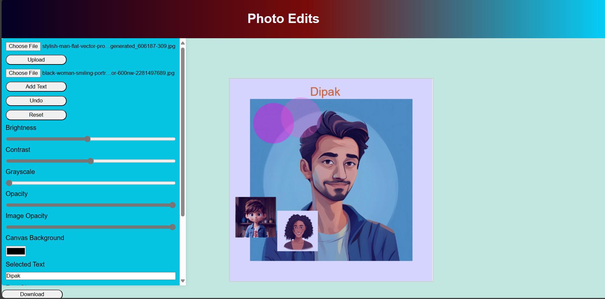

📷 Photo Editor Web App
A simple and interactive Photo Editor built with HTML5, CSS3, JavaScript, and jQuery. This web application allows users to upload images and edit them directly in the browser using the HTML5 <canvas> element. It includes features like adding stickers, shapes, text, and customizing styles such as colors and sizes.

🌟 Features
✅ Import Image – Upload your own photo to edit.

✅ Add Stickers – Drag and drop multiple decorative stickers onto the image.

✅ Draw Shapes – Add circles and rectangles with customizable size and color.

✅ Add Text – Insert text on the image with options to change:

Font style

Font size

Text color

✅ Change Shape Colors – Easily adjust the fill color of shapes.

✅ Resize Elements – Adjust the size of shapes, text, and stickers.

✅ Canvas-Based Editing – Uses HTML5 <canvas> for rendering and manipulation.

🖼️ Demo Screenshot



🚀 How to Use
Clone the repository

bash
Copy
Edit
 ```bash
   git clone https://github.com/Dipak-sahani/Photo-editor-.git

   ```
cd photo-editor
Open index.html in your browser
No server setup required — it's 100% frontend.

🛠️ Technologies Used
HTML5 & Canvas API

CSS3 (for styling)

JavaScript (for logic)

jQuery (for DOM manipulation and events)

📁 Project Structure
bash
Copy
Edit
photo-editor/
├── index.html
├── style.css
├── script.js
├── /images       # Sticker and icon assets
└── demo.png (optional for README)

📌 Future Improvements
Save the final edited image as a downloadable file

Add undo/redo functionality

Add filters (brightness, contrast, grayscale)

Mobile responsive improvements

**Disclaimer: The images used in this project are for demonstration purposes only. They are not intended for commercial use, resale, or any form of monetization.

📄 License
This project is open source and available under the MIT License.